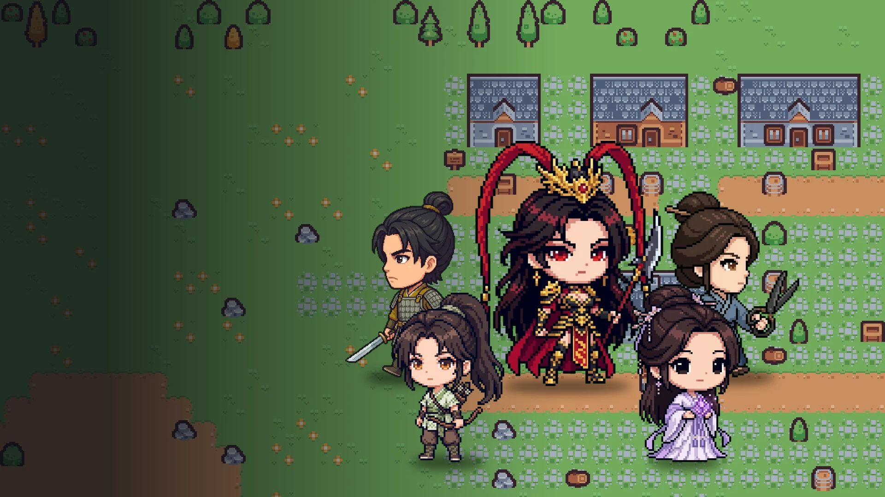

# 仙泉·香布纏．無雙

在 [Larch](https://larch.ink) 的 RPG 系統上做的除草小遊戲。同一片草原，敵兵和妖物一波一波湧上來，挑一位角色上陣，撐得越久，來的越強。

做這個是想試試 Larch 剛加的 RPG 系統能不能撐起一款「無雙」類的即時戰鬥小遊戲。這個 repo 放的是做遊戲時用到的腳本、素材，以及整個專案的設定快照，想在 Larch 上做類似東西的人可以直接拿去參考。

## 五位角色

| 角色 | 普攻 | 專屬武器 | 特色 |
|---|---|---|---|
| 魏續 | 斬擊 | 環首刀 | 血最厚 |
| 貂蟬 | 魔法彈，命中會炸開 | 紫玉法器 | MP 最多 |
| 呂荃 | 射箭，射程 7 格 | 小木弓 | 射程最遠 |
| 呂布 | 斬擊，技能補中距離突刺 | 方天畫戟 | 攻擊最高 |
| 嚴湘 | 斬擊 | 鐵剪刀 | 跑最快 |

每個人有自己的等級、成長曲線和四個技能，2、4、6、8 級各學一招。

營地裡還有一位成素，呂布的女親兵。主角倒下時她會走過來結算戰功，台詞依倒下的是誰而不同。

## 玩法

- 方向鍵或 WASD 移動，J 或空白鍵攻擊，K 衝刺，H 喝補血藥水，1 到 4 放技能。
- 打倒敵人拿戰功。分數到 20、50、100 會加入新兵種，再往上所有敵人會換成更強、體型更大的版本。
- 陣亡會被送回營地，呂布的女親兵成素會結算分數，可以再戰或換角色上陣。
- 大廳可以選單人或連線。連線時看得到其他玩家、可以聊天，怪物、分數和存檔各算各的。

## 這個 repo 裡有什麼

- `assets/characters/`：五位角色與成素的二頭身像素小人，和三格的走路圖（往上彈起、落地微壓扁，平台會在往左走時自動翻面）。
- `assets/icons/`、`assets/weapons/`：技能、道具圖示與專屬武器圖，128 或 64 像素，透明背景。
- `assets/cover/`：封面，以及照地圖資料用 Kenney 圖塊重畫的戰場背景。
- `snapshot/project.json`：整個 Larch 專案的設定（地圖、事件、戰鬥卡、角色資料庫、技能庫、線上設定），`snapshot/map-arena.json` 是單獨拆出來的地圖。
- `scripts/`：產圖、批次建戰鬥卡、上傳素材、安全改專案名稱的 Python 腳本。
- `docs/engine-notes.md`：做的過程中查原始碼確認的平台行為，包含幾個做不到的地方。

## 腳本怎麼跑

腳本都是當時一次性用的，直接照抄需要改路徑。它們需要：

- Larch 的 agent 金鑰，放在 `~/.config/larch/key`。
- 產角色小人和圖示用的是自架的圖片服務（`gen_sd.py` 走 codex-image-service，`gen_sd_gm*.py` 與 `gen_icons.py` 走 gemini-web），金鑰從 `~/.bashrc` 讀。沒有這兩個服務的人，可以把呼叫那一段換成自己的生圖工具。
- 角色小人的參考圖是《仙泉香布纏》的 Q 版定錨圖，不在這個 repo 裡。

去背的做法在 `gen_sd` 系列之後另外跑的程式碼裡，重點只有一個：綠幕去背只修輪廓邊緣的綠邊，不要對整張圖去綠。呂荃穿綠衣服，整張去綠會把衣服壓成灰的。

## 授權

- 程式碼：MIT，見 [LICENSE](LICENSE)。
- 角色、圖片、封面等創作內容：CC BY-NC 4.0，見 [LICENSE-ASSETS.md](LICENSE-ASSETS.md)。

圖塊與部分怪物圖來自 [Kenney](https://kenney.nl)（CC0），由 Larch 平台內建提供。
